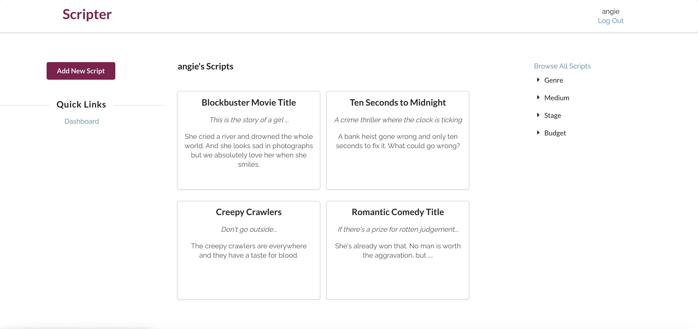
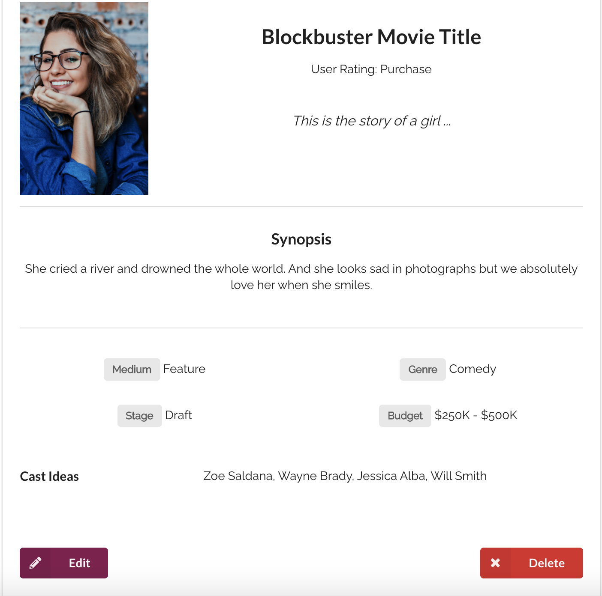
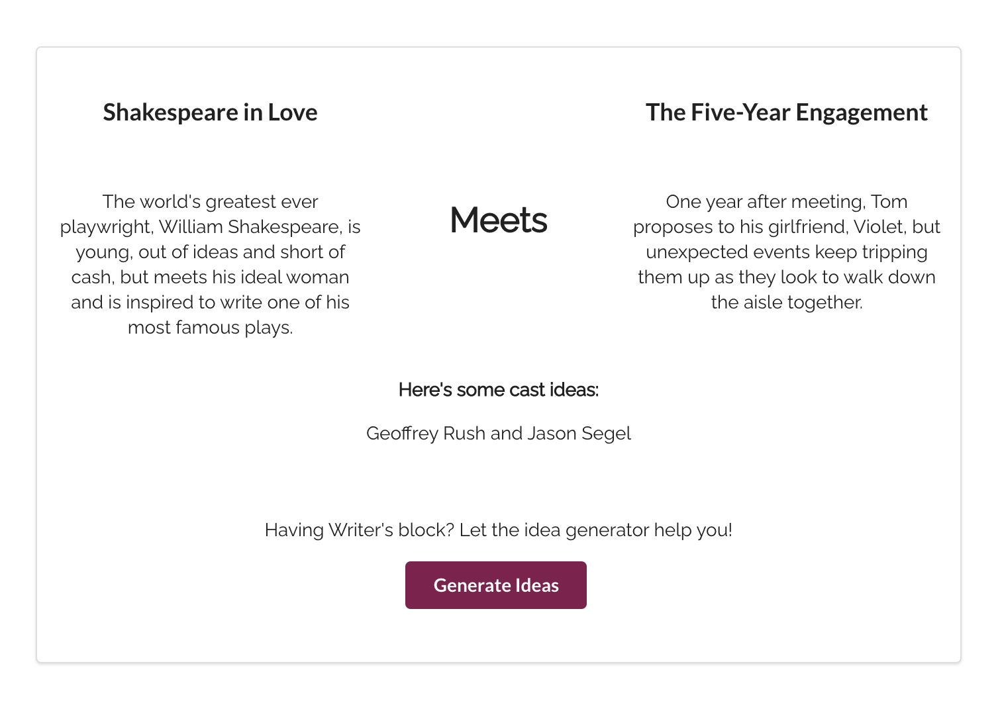

# Scripter
### Get feedback from your peers
  

## The App
Scripter allows to writers to share their logline and synopsis and get feedback on the idea. The simple rating system provides users with a Pass, Consider, or Purchase grade.
  

## Screenshot(s):
Dashboard

Script Detail Page

Idea Generator

  

## Technologies Used:
- MongoDB
- Express
- React
- Node

## Try it out:
[Trello board](https://trello.com/b/HHUExaPJ/scripter)
 
[Heroku](https://scripterapp.herokuapp.com/)

## Icebox:
- Allowing users to leave comments on other user's scripts.
- Adding functionality to attach other users to their projects, as a Producer or Director, for example.